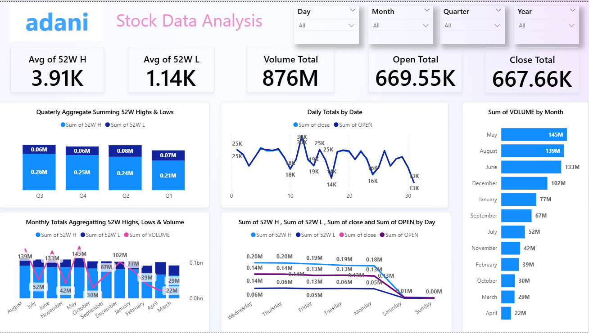

# 📊 Adani Stock Data Analysis – Power BI Dashboard

## 📌 Project Overview

This project analyzes historical stock performance data of **Adani Enterprises Ltd.** using **Power BI**.  
The objective is to transform raw stock market data into meaningful insights through interactive dashboards.

---

## 🎯 Key Performance Metrics

- **Average 52 Week High:** 3.91K  
- **Average 52 Week Low:** 1.14K  
- **Total Volume Traded:** 876M  
- **Total Open Value:** 669.55K  
- **Total Close Value:** 667.66K  

---

## 📊 Key Insights

### 📅 Quarterly Analysis
- Q3 recorded the highest aggregated 52W High (~0.26M)
- Stable movement observed across Q2 and Q4
- Helps identify seasonal stock performance trends

### 📈 Daily Trend Analysis
- Peak daily values crossed **25K+**
- Mid-month volatility observed
- Identified fluctuations in opening and closing prices

### 📊 Monthly Volume Insights
- **Highest Volume:** May (~145M)
- Followed by August (~139M) and July (~133M)
- Lower trading activity in March & April (~22M–29M)

---

## 🛠 Tools & Technologies Used

- Power BI  
- DAX  
- Data Modeling  
- Data Cleaning & Transformation  
- Interactive Filters (Day / Month / Quarter / Year)

---

## 🚀 Dashboard Features

✔ KPI Cards for key stock metrics  
✔ Monthly Volume Comparison  
✔ Quarterly Aggregation Analysis  
✔ Daily Price Trend Visualization  
✔ Dynamic Filters  
✔ Interactive Drill-down Capability  

---

## 🖼 Dashboard Preview

Add your dashboard image below:

```markdown

